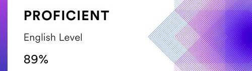

## Содержание CV:
1. Имя и фамилия
1. Контакты для связи
1. Краткая информация о себе (ваша цель и приоритеты, подчеркните свои сильные стороны, расскажите о своём опыте работы, если опыта работы нет, расскажите о своём стремлении учиться и узнавать новое)
1. Навыки (языки программирования, фреймворки, методологии, системы контроля версий и инструменты разработки, которыми вы владеете)
1. Примеры кода
1. Опыт работы. Junior Dev может перечислить учебные проекты с указанием использованных навыков и ссылками на исходный код.
1. Образование (включая пройденные курсы и тренинги)
1. Английский язык (уровень английского языка, если была языковая практика, расскажите о ней)
## Рекомендации к составлению CV:
1. оформление CV на ваше усмотрение. Старайтесь выполнить работу максимально качественно. При выборе дизайна CV можно руководствоваться примерами, приведёнными в материалах к заданию
1. CV составляется на английском языке.
1. при составлении CV рекомендуется указывать реальные данные
1. в CV добавьте своё фото или аватарку. Фото предпочтительнее
1. в CV укажите актуальные контакты для связи, в т.ч никнейм на дискорд-сервере rs school
1. в качестве примера кода приведите решение задачи с сайта Codewars.
1. Если решённых задач пока нет, подойдёт задача, которую нужно решить при регистрации на Codewars
1. код добавляется при помощи символов и тегов, а не картинкой
1. для выполненных проектов добавьте название проекта, ссылку на код проекта на гитхабе или ссылку на страницу проекта.
1. Если выполненных проектов пока нет, в качестве первого проекта укажите само CV


# Bybin Mark


## Contact information

- Github: [@knifewifealive](https://github.com/knifewifealive)
- Email: bybinmark@yandex.ru
- Discord: [bybinmark(@knifewifealive)](https://discordapp.com/users/292592515398238208/)
- Telegram: [@cagepagerage](https://t.me/cagepagerage)

## Briefly about myself

It is important to me to be inquisitive, seeking answers to complex questions, developing, fun and creative. I completely agree with the statement below:

> “A person’s worth is measured by the worth of what he values.” \
> Marcus Aurelius.

I have four years of experience working with people in the service industry:
* half a year as a waiter (2014 / 2015 summer's)
* a year and a half as a barista (2016 / 2017 summer's, may 2020 - may 2021)
* a year as a cruise travel agent (january 2019 - february 2020)
* a year as a beauty salon receptionist (october 2022 - october 2023)

## Skills and Proficiency:

- HTML5, CSS3
- JavaScript Basics
- Git, GitHub
- VS Code
- Figma

## Code example:

### [Char Code Calculation kata from CodeWars](https://www.codewars.com/kata/57f75cc397d62fc93d000059)

#### Description:

Given a string, turn each character into its ASCII character code and join them together to create a number - let's call this number `total1`:

```
'ABC' --> 'A' = 65, 'B' = 66, 'C' = 67 --> 656667
```

Then replace any incidence of the number `7` with the number `1`, and call this number 'total2':

```
total1 = 656667
              ^
total2 = 656661
              ^
```
Then return the difference between the sum of the digits in total1 and total2:

```
  (6 + 5 + 6 + 6 + 6 + 7)
- (6 + 5 + 6 + 6 + 6 + 1)
-------------------------
                       6
```
#### Solution:

```
function calc(str){
  const amountOfSevens = str.split('')
            .map(item => item.charCodeAt(0))
            .join('')
            .match(/7/g);
  
  return amountOfSevens ? amountOfSevens.length * 6 : 0;
            
}
```
## Projects

1. [CreateX](https://knifewifealive.github.io/createX/), project description and code: https://github.com/knifewifealive/createX

1. Deposit calculator, project descriprion and code: https://github.com/knifewifealive/depositCalculator

## Education and Courses

- Higher incomplete education, Tyumen Industrial University, Business Informatics and Mathematics, Applied Mathematics and Informatics, 2017 - 2021
- [Aroken Frontend Course](https://youtube.com/playlist?list=PLNaJj8xMY1XQgYzVhLEFD4WSKqEhj4Sx1&si=r2UpvqSj1x2VTj_O) (finished)
- [RS School Stage 0](https://github.com/rolling-scopes-school/tasks/tree/master/stage0) (in progress)

## Languages

- English - Intermediate/Upper-intermediate (according to the online test at www.efset.org)

- Russian - Native